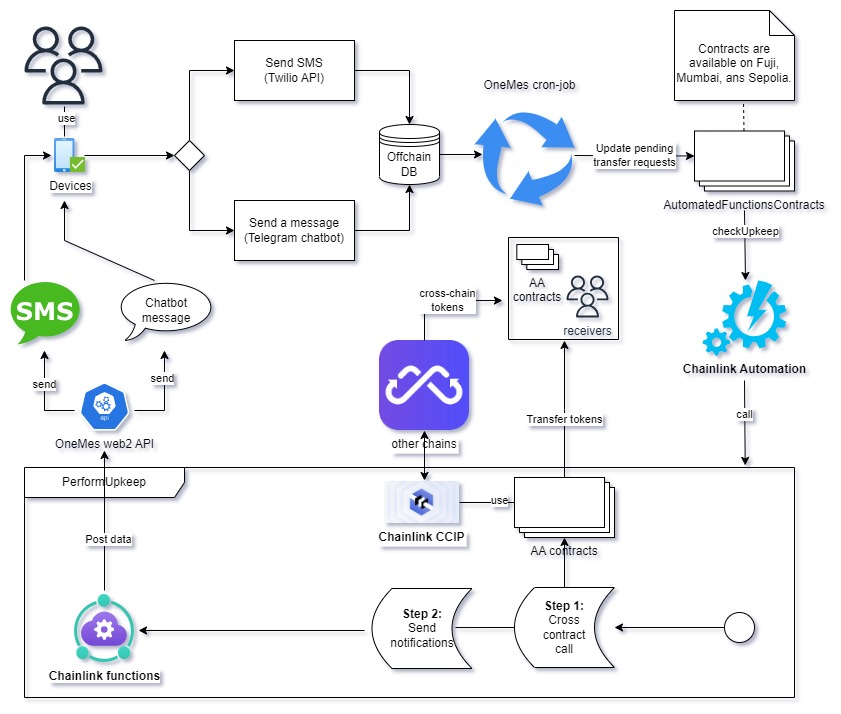

## Overview
OneMes - Offline & Online Token transfer with messaging.

## Demo information:

- AA wallet: [app.onemes.a2n.finance](https://app.onemes.a2n.finance)
- Telegram bot: [OneMes](http://t.me/Onemes_a2n_bot)
- Phone number to send a transfer token request: ***+17828008299***

## Chainlink technology
OneMes has utilized Chainlink Technologies as core components, [more details can be found here](./contracts/README.md).
## System architecture


We have an explain of this architecture, please see our [introduction video](https://youtu.be/0q8nc1laWmE?t=109).

## Prerequisites

To understand source code, you should have basic knowlege of:
- Solidity
- Hardhat
- Chainlink technologies.
- NodeJS
- React
- Next JS
- Cloud Mongo database. 
- Wgami
- Linux & docker commands.

## Installation steps
**Step 1: Install Dev environment**

- Install NodeJS (16+)
- Install VisualCode studio.
- Install Solidity & Hardhat addons for VisualCode.
- Create a new collection on Mongo Cloud Database.


**Step 2: Install webapp libraries**
- Go to each folder
    - ```cd webapp ``` -> ```npm i```
    - ```cd admin ``` -> ```npm i```
    - ```cd carbon-credit-mkp ``` -> ```npm i```

**Step 3: Deploy smart contracts**

Read this file [README.md](./contracts/README.md) for more details.

**Step 4: Setup .env**

Setup ENV file in each folder: Frontend, Backend, Contracts, Cron-job, TelegramBot. 

- ```cp .env.example .env``` and change variable values.


## Commands to start

- To run Backend and Frontend applications in Dev mode, use this command: ```npm run dev```. 
- To run Backend and Frontend applications in Production mode, use this command: ```npm run build``` and ```pm2 run npm --name "your app name" -- run start```

## Test smart contracts

Read this file [README.md](./contracts/README.md) for more details.`

## Contribution
We welcome any ideas or suggestions to help us make OneMes better. Please do not hesitate to contact us via email at levi@a2n.finance.

## License

This package is released under the BSL 1.1 License.
